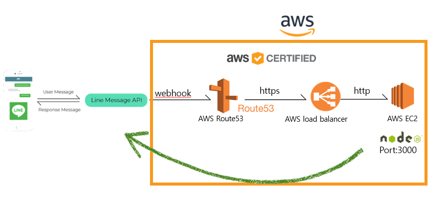

# Mother project : Line ChatBot Translator 
## Advanced LINE Chatbot
- Code is refactored entirely
- We applied the lastest JS pattern for better readability
- A comment is added for maintaining
- It's not a local service. It's really working well in the server running time.
- It provides more various languages compared to before version.

### Architecture

### Adding LINE friends using a QR code

P.S: Webhook URL [osschatbot.tk](osschatbot.tk)